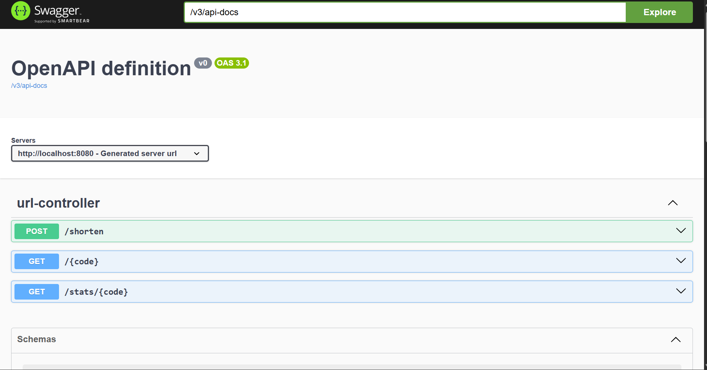
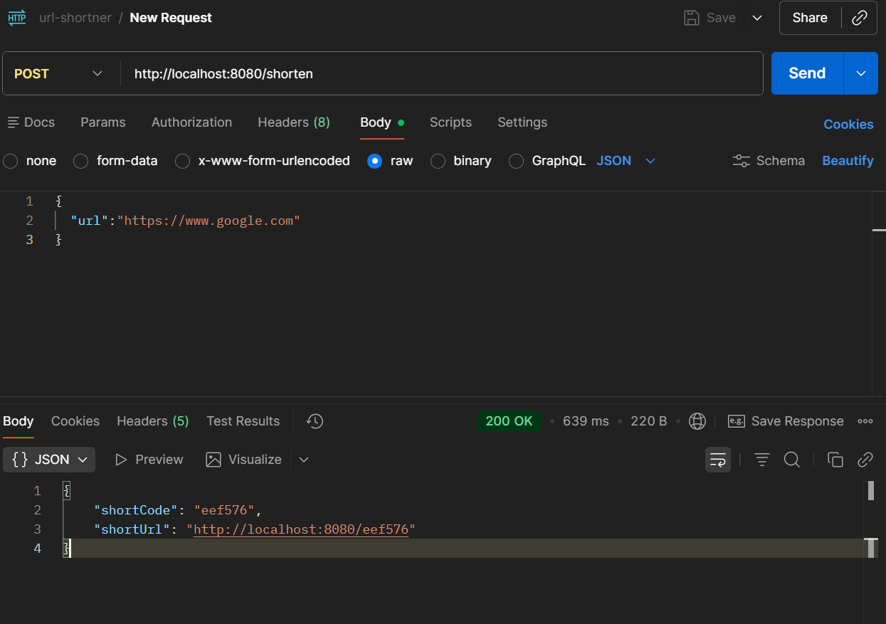
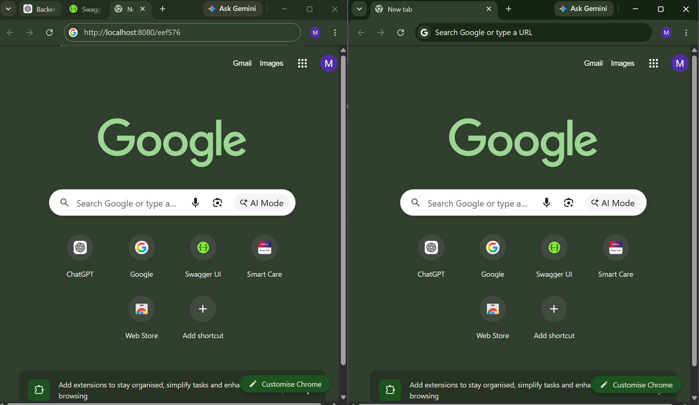
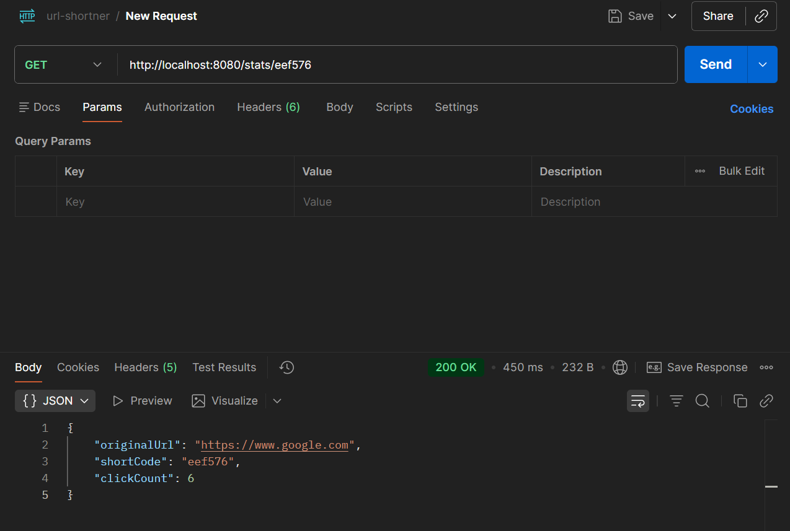
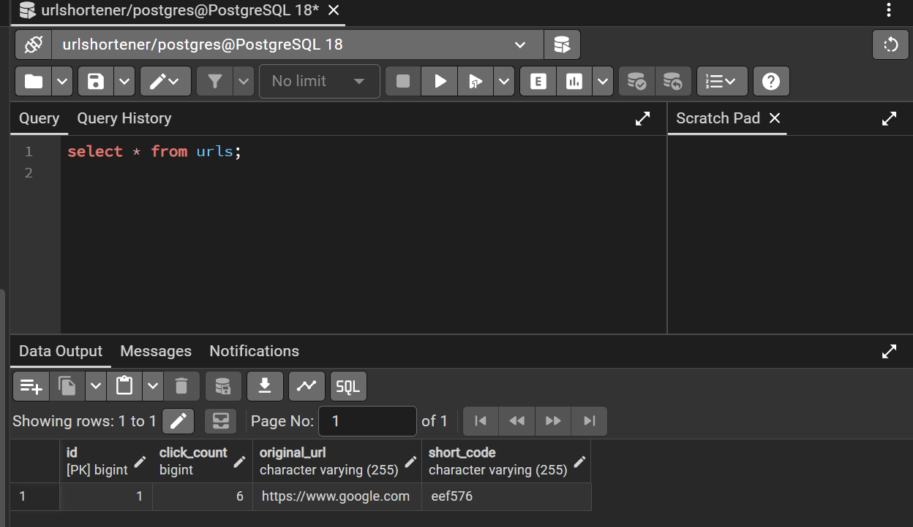
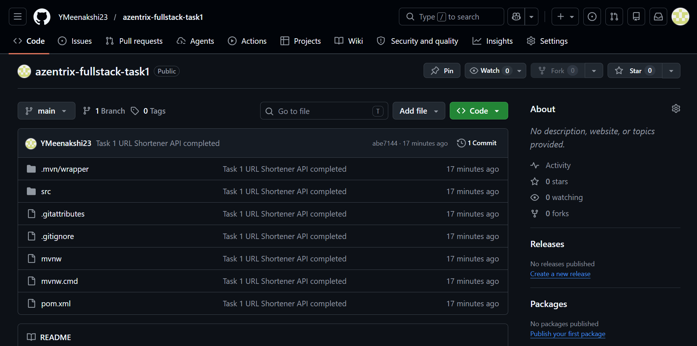

# Azentrix Fullstack Task 1 - URL Shortener API

## Overview

A RESTful URL Shortener API built using Spring Boot and PostgreSQL.

This application allows users to:

* Shorten long URLs
* Redirect using generated short URLs
* Track click counts
* View URL analytics
* Access API documentation using Swagger UI

---

## Tech Stack

* Java 22
* Spring Boot
* Spring Data JPA
* PostgreSQL
* Maven
* Swagger OpenAPI

---

## Project Structure

```text
src/
├── controller
├── service
├── repository
├── entity
├── dto
└── resources
```

---

## Approach

### URL Shortening

The user submits a long URL through the `/shorten` endpoint.

A unique 6-character short code is generated using UUID and stored in PostgreSQL along with:

* Original URL
* Short Code
* Click Count

### Redirection

When a user accesses:

```text
http://localhost:8080/{shortCode}
```

the application:

1. Finds the original URL
2. Increments the click count
3. Redirects the user

### Analytics

The `/stats/{code}` endpoint provides:

* Original URL
* Short Code
* Number of Clicks

---

## Database Setup

Create PostgreSQL database:

```sql
CREATE DATABASE urlshortener;
```

Configure your database credentials in:

```properties
application.properties
```

Example:

```properties
spring.datasource.url=jdbc:postgresql://localhost:5432/urlshortener
spring.datasource.username=postgres
spring.datasource.password=yourpassword

spring.jpa.hibernate.ddl-auto=update
spring.jpa.show-sql=true
```

---

## Running the Application

Clone the repository:

```bash
git clone https://github.com/YMeenakshi23/azentrix-fullstack-task1.git
```

Move into project directory:

```bash
cd azentrix-fullstack-task1
```

Run the application:

```bash
mvn spring-boot:run
```

Application URL:

```text
http://localhost:8080
```

Swagger Documentation:

```text
http://localhost:8080/swagger-ui/index.html
```

---

## API Endpoints

### Create Short URL

**POST** `/shorten`

Request:

```json
{
  "url": "https://www.google.com"
}
```

Response:

```json
{
  "shortCode": "eef576",
  "shortUrl": "http://localhost:8080/eef576"
}
```

---

### Redirect to Original URL

**GET** `/{code}`

Example:

```text
GET /eef576
```

Redirects to:

```text
https://www.google.com
```

---

### URL Analytics

**GET** `/stats/{code}`

Response:

```json
{
  "originalUrl": "https://www.google.com",
  "shortCode": "eef576",
  "clickCount": 1
}
```

---

# Screenshots

## 1. Swagger UI

<!-- INSERT swagger-home.png HERE -->



---

## 2. Create Short URL API

<!-- INSERT create-short-url.png HERE -->



---

## 3. Redirect Working

<!-- INSERT redirect-working.png HERE -->



---

## 4. Analytics Endpoint

<!-- INSERT stats-endpoint.png HERE -->



---

## 5. PostgreSQL Database Records

<!-- INSERT database-records.png HERE -->



---

## 6. GitHub Repository

<!-- INSERT github-repository.png HERE -->



---

## Features Implemented

* URL Shortening
* URL Redirection
* Click Tracking
* Analytics Endpoint
* PostgreSQL Persistence
* Swagger Documentation
* Error Handling for Invalid URLs
* Layered Architecture (Controller, Service, Repository)

---

## Future Improvements

* Custom short codes
* URL expiration support
* User authentication
* QR code generation
* Advanced analytics dashboard

---

## Author

Meenakshi Yakkala

GitHub:
https://github.com/YMeenakshi23
